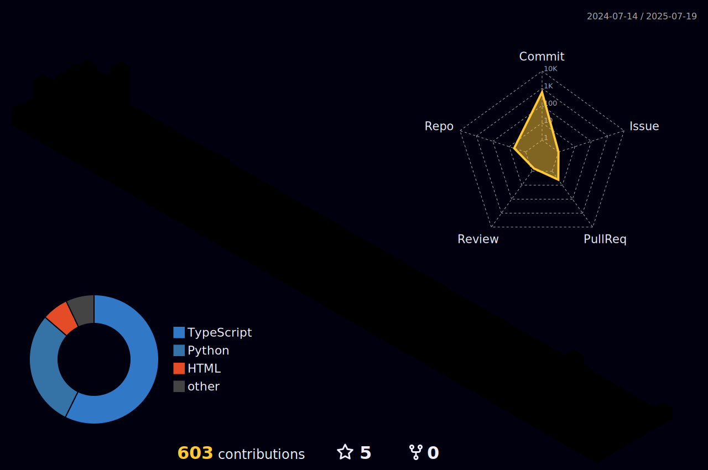

<!--  --->

# Hi , I'm Juan Pablo a 🇧🇷 Software Developer </h1>

- 🚀 Junior Full-stack Developer focused on **Back-end**
- 👨‍💻 I'm currrently working at ChipTiming [**The Largest Eletronic Timing company in Latin America**]
- 👽 Fun fact: *I'm a hybrid athlete*
#

  

  
 |  |  |  
 | ----------- | ----------- |

<!---[

  
  

](url)--->

## 📞 Contact

  
  
  

## 💻 Languages and Tools

  

### ✍️ Currently learning
<H4>I'm currently diving into several exciting areas of software development. My focus includes learning Go, and Rust. Additionally, I'm exploring software architecture principles, mastering clean code practices, and implementing CI/CD pipelines. This journey aims to enhance my skills and contribute to high-quality, maintainable, and scalable software solutions.</H4>

## 🏆 GitHub Trophies
   

     
  

## 😋 Feeding...
  
